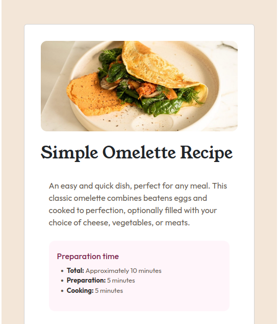

# Frontend Mentor - Recipe page solution

This is a solution to the [Recipe page challenge on Frontend Mentor](https://www.frontendmentor.io/challenges/recipe-page-KiTsR8QQKm). Frontend Mentor challenges help you improve your coding skills by building realistic projects. 

## Table of contents

- [Overview](#overview)
  - [The challenge](#the-challenge)
  - [Screenshot](#screenshot)
  - [Links](#links)
- [My process](#my-process)
  - [Built with](#built-with)
  - [What I learned](#what-i-learned)
  - [Continued development](#continued-development)
  - [Useful resources](#useful-resources)
- [Author](#author)


## Overview

### Screenshot




### Links

- Solution URL: [https://github.com/mutish/recipe.git]
- Live Site URL: [https://mellifluous-hummingbird-3f2a84.netlify.app/]

## My process

### Built with

- Semantic HTML5 markup
- CSS custom properties
- Bootstrap

### What I learned

I learned how to input lists both ordered and unordered, tables as well as styling them.


```html
<!-- lists -->
     <ul>
            <li>2-3 large eggs</li>
            <li>Salt, to taste</li>
            <li>Pepper, to taste</li>
            <li>1 tablespoon of butter or oil</li>
            <li>Optional fillings: cheese, diced vegetables, cooked meats, herbs</li>
          </ul>
<!-- table -->
              <table class="ntable">
                <tbody>
                  <tr>
                    <td>Calories</td>
                    <td>277 kcal</td>
                  </tr>
                  <tr>
                    <td>Carbs</td>
                    <td>0g</td>
                  </tr>
                  <tr>
                    <td>Protein</td>
                    <td>20g</td>
                  </tr>
                  <tr>
                    <td>Fat</td>
                    <td>22g</td>
                  </tr>

                </tbody>
              </table>
```
```css
/* lists */
ul, ol {
      margin-top: 0.5rem;
      padding-left: 1.2rem;
      font-family: 'Outfit';
      color: hsl(30, 10%, 34%)
}

/* table */
.ntable {
      margin-top: 1rem;
      width: 100%;
      border-collapse: collapse;
      font-family: 'Outfit';
}

.ntable td {
      padding: 0.5rem;
      border-bottom: 1px solid hsl(14, 45%, 36%);
      font-weight: bold;
      color: hsl(14, 45%, 36%);
}
```

### Continued development

I would like to focus on styling, its becoming a challenge for me.


### Useful resources

- [resource 1](https://cssreference.io) - This helped me in the CSS part a lot. Its a cool website. It has many CSS stylings arrnged alphabetically and each style has an explanation on it.


## Author

- Frontend Mentor - [@mutish]([https://www.frontendmentor.io/profile/mutish])

